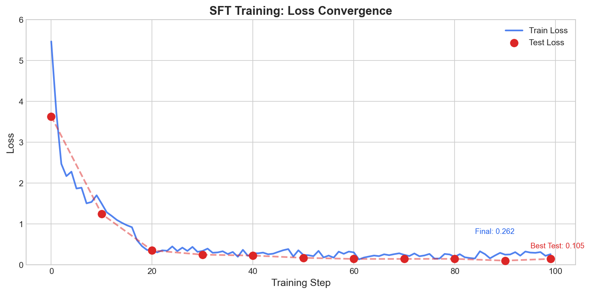
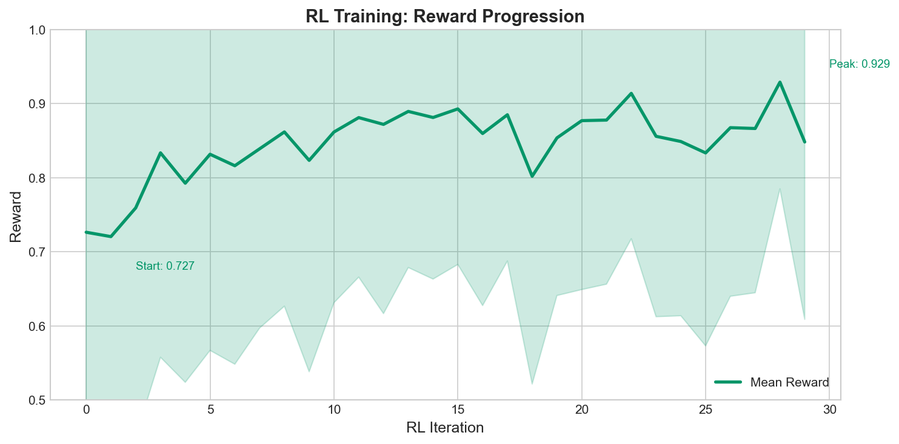
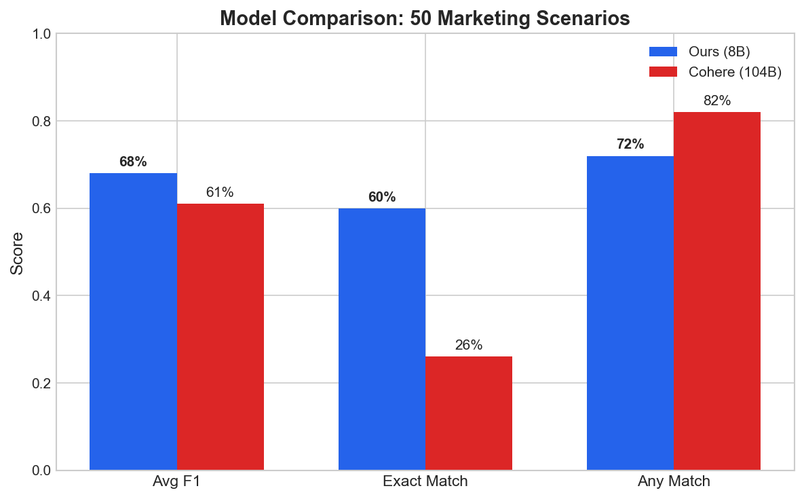
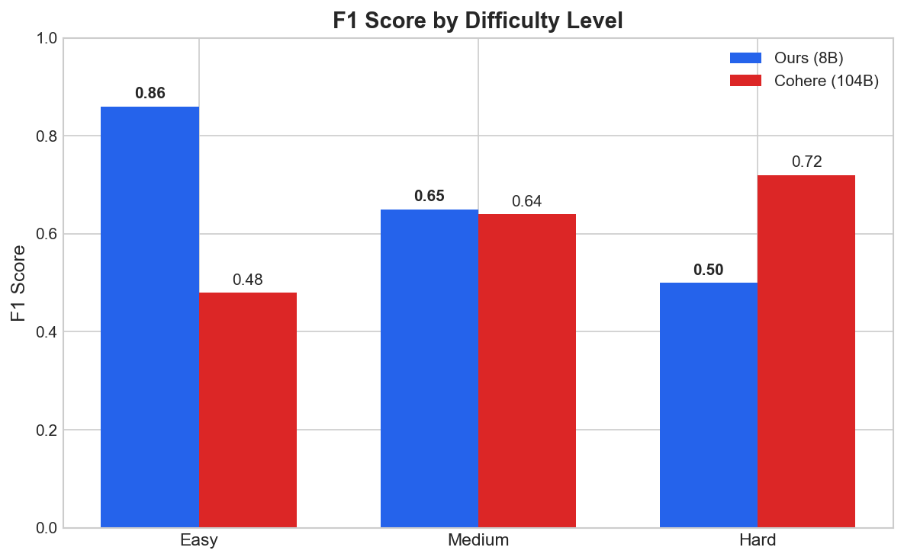

# Memory Routing Agent

**A specialized 8B model that outperforms its 104B teacher on marketing conversation classification.**

[](https://huggingface.co/MuratcanKoylan/Marketing-Memory-Routing-8B)
[](https://github.com/muratcankoylan/memory-routing-agent)
[](LICENSE)

---

## The Experiment

This project demonstrates **prompt distillation**: training a small, specialized model to outperform the large model that generated its training data.

### The Challenge

Marketing AI assistants need to remember the right information from conversations. Not everything is worth storing - you need to distinguish between:
- **Valuable**: "Our brand voice is professional but approachable" → Store in long-term memory
- **Transactional**: "What time is the meeting tomorrow?" → Don't store

This is a **13-category classification problem** with nuanced distinctions between company-level and user-level information, different persistence horizons, and the critical ability to say "none" for irrelevant content.

### The Approach

1. **Generate synthetic data** using Cohere Command-R-Plus (104B) as the teacher
2. **Fine-tune Llama-3.1-8B** with LoRA using Tinker's training platform
3. **Apply reinforcement learning** with a custom reward function
4. **Benchmark against the teacher** on challenging, held-out scenarios

### The Result

| Model | Parameters | Avg F1 | Exact Match |
|-------|------------|--------|-------------|
| **Ours** | **8B** | **0.68** | **60%** |
| Cohere Command-R-Plus | 104B | 0.61 | 26% |

**Our 8B model achieves 11.1% higher F1 and 2.3x better exact match accuracy than the 104B teacher, while being 13x smaller.**

The student surpassed the teacher through:
- **Focused training**: The model only learns this one task, not general capabilities
- **RL refinement**: The reward function optimizes for exact category matching, not just plausible outputs
- **Clean data**: Synthetic data with consistent labeling, no noise from human annotation disagreements

---

## Training Visualizations

### Phase 1: Supervised Fine-Tuning



100 training steps reduced loss from 5.47 to 0.26 (95% reduction). The model learned the basic classification task in the first epoch.

### Phase 2: Reinforcement Learning



30 RL iterations improved mean reward from 0.73 to 0.93. The reward function combines F1 score, temporal alignment, scope correctness, and storage efficiency.

### Model Comparison



Our model excels at exact matching (60% vs 26%) because RL optimizes for getting all categories right, not just some.

### Performance by Difficulty



The 8B model dominates on easy cases (+79% F1) and matches on medium cases. The 104B model still wins on hard multi-label scenarios.

---

## Key Results

| Metric | Our Model (8B) | Cohere (104B) |
|--------|----------------|---------------|
| **Avg F1** | **0.68** | 0.61 |
| **Exact Match** | **60%** | 26% |
| Any Match | 72% | 82% |
| Model Size | 8B | 104B |
| **Improvement** | **+11.1% F1** | baseline |

### Reward Components (Final RL Iteration)

| Component | Score | Description |
|-----------|-------|-------------|
| R_F1 | 0.90 | F1 score vs gold labels |
| R_temp | 0.95 | Temporal alignment |
| R_parity | 1.00 | Company/user scope |
| R_eff | 1.00 | Storage efficiency |

---

## What It Does

The Memory Routing Agent classifies marketing conversations into 13 memory categories:

### Company Categories (Long-term business context)
| Category | Description | Persistence |
|----------|-------------|-------------|
| `company.brand_core` | Voice, values, positioning | Long (>1y) |
| `company.strategic_signatures` | Decision frameworks | Long (>1y) |
| `company.knowledge_artifacts` | Docs, style guides | Long (>1y) |
| `company.business_priorities` | Quarterly goals | Short (<3m) |
| `company.tools_config` | Integrations, APIs | Medium (~6m) |
| `company.performance_context` | Campaign metrics | Rolling (~6m) |

### User Categories (Personal preferences)
| Category | Description | Persistence |
|----------|-------------|-------------|
| `user.communication_style` | Tone, format preferences | Long (>1y) |
| `user.strategic_approach` | Personal priorities | Long (>1y) |
| `user.role_context` | Title, scope | Medium (~1y) |
| `user.workflow_patterns` | Review cadence | Medium (~1y) |
| `user.session_history` | Immediate context | Short (<2w) |
| `user.interaction_preferences` | Coaching style | Evolving |

### Special
| Category | Description |
|----------|-------------|
| `none` | Transactional or irrelevant content |

---

## Training Pipeline

```
┌─────────────────────────────────────────────────────────────────┐
│                    TRAINING PIPELINE                            │
├─────────────────────────────────────────────────────────────────┤
│                                                                 │
│  1. SYNTHETIC DATA GENERATION                                   │
│     ├── Cohere Command-R-Plus (104B) as teacher                │
│     ├── 2,001 marketing conversations                          │
│     └── 13 category labels + persistence horizons              │
│                                                                 │
│  2. SUPERVISED FINE-TUNING (SFT)                               │
│     ├── Base: meta-llama/Llama-3.1-8B                          │
│     ├── LoRA rank 32                                           │
│     ├── 100 steps, batch size 128                              │
│     └── Cross-entropy loss                                     │
│                                                                 │
│  3. REINFORCEMENT LEARNING (RL)                                │
│     ├── 30 iterations, 64 groups × 32 samples                  │
│     ├── Importance sampling policy gradient                    │
│     └── Composite reward: F1 + temporal + parity + efficiency  │
│                                                                 │
└─────────────────────────────────────────────────────────────────┘
```

### Reward Function

```
R_total = 0.6 × R_F1 + 0.2 × R_temp + 0.1 × R_parity + 0.1 × R_eff
```

| Component | Weight | Description |
|-----------|--------|-------------|
| R_F1 | 60% | F1 score vs gold labels |
| R_temp | 20% | Persistence horizon alignment |
| R_parity | 10% | Company/user scope correctness |
| R_eff | 10% | Storage efficiency (≤3 categories) |

---

## Quick Start

### Installation

```bash
# Clone the repository
git clone https://github.com/muratcankoylan/memory-routing-agent.git
cd memory-routing-agent

# Create virtual environment
python -m venv venv
source venv/bin/activate

# Install dependencies
pip install -r requirements.txt
```

### Environment Setup

```bash
# Create .env file with your API keys
echo "TINKER_API_KEY=your_tinker_key" >> .env
echo "COHERE_API_KEY=your_cohere_key" >> .env
echo "HF_TOKEN=your_huggingface_token" >> .env
```

### Run Inference

```python
import tinker
from tinker import types
from tinker_cookbook import renderers
from tinker_cookbook.tokenizer_utils import get_tokenizer

# Load model from Tinker checkpoint
service_client = tinker.ServiceClient()
checkpoint = "tinker://4f4bae1f-5a95-5f53-a55a-a14f2872825c:train:0/sampler_weights/rl_iter_012"
sampling_client = service_client.create_sampling_client(model_path=checkpoint)

# Setup tokenizer and renderer
tokenizer = get_tokenizer("meta-llama/Llama-3.1-8B")
renderer = renderers.get_renderer(name="llama3", tokenizer=tokenizer)

# Classify a conversation
conversation = """
USER: Our brand voice is professional but approachable. Think Harvard Business Review meets Slack.
ASSISTANT: So authoritative content with a conversational tone?
USER: Exactly. We never use jargon without explaining it first.
"""

messages = [
    {"role": "system", "content": "You route marketing conversations into structured memory categories..."},
    {"role": "user", "content": f"Analyze this conversation:\n\n{conversation}"}
]

prompt = renderer.build_generation_prompt(messages)
params = types.SamplingParams(max_tokens=100, temperature=0.1, stop=renderer.get_stop_sequences())
result = sampling_client.sample(prompt=prompt, sampling_params=params, num_samples=1).result()

response, _ = renderer.parse_response(result.sequences[0].tokens)
print(f"Categories: {response['content']}")
# Output: company.brand_core
```

---

## Project Structure

```
memory-routing-agent/
├── assets/                   # Training visualizations
│   ├── sft_loss.png
│   ├── rl_reward.png
│   ├── rl_components.png
│   ├── model_comparison.png
│   └── difficulty_comparison.png
├── synthetic_data/           # Data generation pipeline
│   ├── pipeline.py           # Cohere-based conversation generator
│   ├── run_diverse_generation.py
│   └── merged_training_dataset_2001.jsonl
├── training/                 # Training scripts
│   ├── train_v2.py           # Main training script (SFT + RL)
│   ├── preprocess.py         # Data preprocessing
│   ├── rl_env.py             # RL environment and reward function
│   ├── final_benchmark.py    # Benchmark evaluation
│   ├── logs/                 # Training logs (JSONL)
│   └── benchmarks/           # Benchmark results
├── huggingface/              # HuggingFace upload scripts
├── docs/                     # Documentation
│   ├── PRD.md                # Product requirements
│   └── tinker_docs.md        # Tinker reference
├── MODEL_CARD.md             # Model card
└── README.md                 # This file
```

---

## Benchmark

The Marketing Routing Benchmark contains 50 challenging scenarios across 7 domains:

| Domain | Scenarios | Description |
|--------|-----------|-------------|
| Brand & Positioning | 8 | Brand voice, values, identity |
| Strategic Decisions | 8 | Decision frameworks, heuristics |
| Performance & Metrics | 8 | Campaign metrics, learnings |
| Tools & Integrations | 6 | Tech stack, APIs |
| User Preferences | 10 | Communication style, workflow |
| Business Priorities | 6 | Goals, focus areas |
| Knowledge Artifacts | 4 | Docs, playbooks, templates |

### Run Benchmark

```bash
python training/final_benchmark.py
```

---

## Training Your Own Model

### 1. Generate Synthetic Data

```bash
cd synthetic_data
python run_diverse_generation.py --num_items 1000
```

### 2. Preprocess Data

```bash
python training/prepare_data.py
```

### 3. Run Training

```bash
python training/train_v2.py
```

### 4. Evaluate

```bash
python training/final_benchmark.py
```

---

## Limitations

- **Multi-label**: Under-predicts when multiple categories apply
- **Overlap**: Struggles with company/user category overlap on edge cases
- **Domain**: Marketing-specific; not tested on other domains

---

## Links

- **HuggingFace Model**: [MuratcanKoylan/Marketing-Memory-Routing-8B](https://huggingface.co/MuratcanKoylan/Marketing-Memory-Routing-8B)
- **GitHub Repository**: [muratcankoylan/memory-routing-agent](https://github.com/muratcankoylan/memory-routing-agent)
- **Training Platform**: [Tinker by Thinking Machines](https://thinkingmachines.ai/)

---

## Citation

```bibtex
@misc{memory-routing-agent-2025,
  title={Memory Routing Agent: Prompt Distillation for Marketing AI},
  author={Muratcan Koylan},
  year={2025},
  howpublished={\url{https://github.com/muratcankoylan/memory-routing-agent}},
}
```

---

## License

Apache 2.0

---

## Acknowledgments

- [Thinking Machines](https://thinkingmachines.ai/) for the Tinker training platform
- [Cohere](https://cohere.com/) for Command-R-Plus teacher model
- [Meta](https://ai.meta.com/) for Llama 3.1 base model
- [Anthropic](https://anthropic.com/) for Claude, which assisted in developing this project
